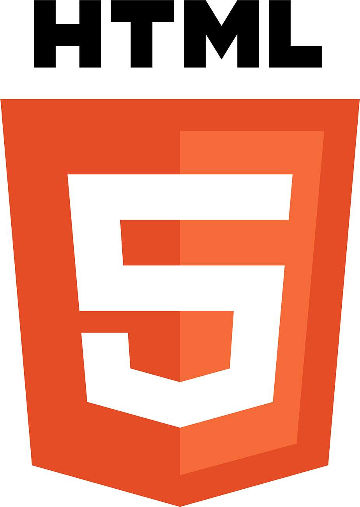
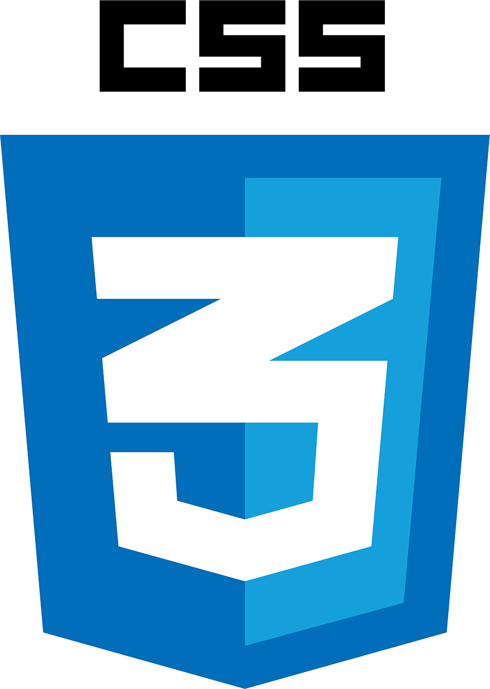
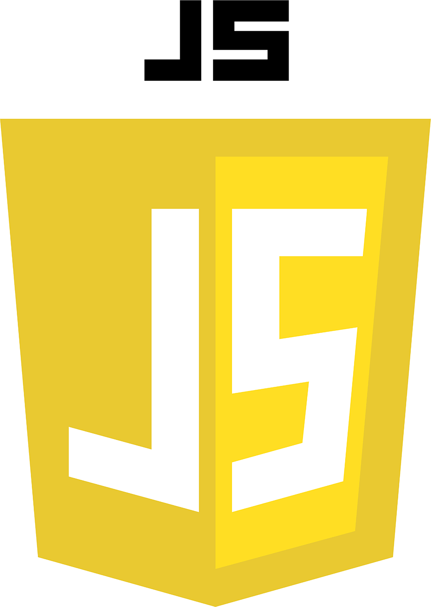

 

##   Reto Videconsola con CSS

----------------------------------

[Presentación](#id1)

[Reto](#id2)

[Información adicional](#id3)

[Instrucciones de instalación](#id4)

[Funciones de la consola](#id5)

[Actualizaciones del proyecto](#id6)

###   Presentación
 

<b>1r Proyecto del Bootcamp programación desde cero de la academia GeeksHubs Academy, Videoconsola con CSS.</b>

###   Reto

<b> Copiar el diseño frontal de una videoconsola portátil, para ello utilizaremos las siguientes tecnologías:</b>
     HTML5 
     CSS3 
     JavaScript 

<b>El uso de Flexbox es crucial en este caso.</b>

<b>También haremos uso de las siguientes herramientas:</b>
     Visual Studio Code
     Git
    GitHub
  
  
  
  
    
    
<b>Hacer botones que reaccionen al encendido da puntos extra.</b>

###  Información adicional

<b> El código html y CSS se ha realizado para representar la imagen frontal de la videoconsola Nintendo Switch, aparte se ha hecho uso de JavaScript para dar funcionalidades al proyecto.</b>

<b>Se debe utilizar Git-Hub y realizar un README funcional para demostrar que se han aprendido los conceptos y las buenas prácticas.</b>

###  Instrucciones de instalación

<b> Descargue el .Zip, descomprímalo en una carpeta y abra el archivo index.html en su buscador de preferencia.</b>

### Funciones de la consola

<b> La consola aparecerá con los mandos desacoplados a propósito, para poder acoplarlos pulse el botón "Home" del joy-con derecho (). Al hacer clic los joy-con se acoplarán a la consola y se reproducirá el característico chasquido de la Nintendo Switch. Una vez hecho esto, no se volverán a desacoplar al no ser que refresque la página. Tras eso, si volvemos a hacer clic en el botón "Home" la pantalla se encenderá mostrando el menú principal de la consola.</b>

### Actualizaciones del proyecto

<b> 10/12/2022 - Se han creado las divisiones de la consola, se ha empezado a diseñar los mandos "Joy-con" añadiendo botones con divs y su ":active".</b>

<b>11/12/2022 - Se ha realizado el diseño de la consola con sus botones correspondientes y sus ":active"</b>

<b>12/12/2022 - Se han añadido detalles estéticos como el sombreado, se han sustituido unidades de medida a "vh" para medidas y márgenes generales y "px" para los border-radius y los sombreados.</b>

<b>13/12/2022- Se sustituyen el resto de unidades de medida a "vh" incluidos los "fr". Se añade código JavaScript para añadir la funcionalidad para acoplar los joy-cons y encender la consola, ambas opciones desde el botón "Home" del joy-stick derecho. El proyecto se da por finalizado.</b> 

[Ir al inicio](#top)